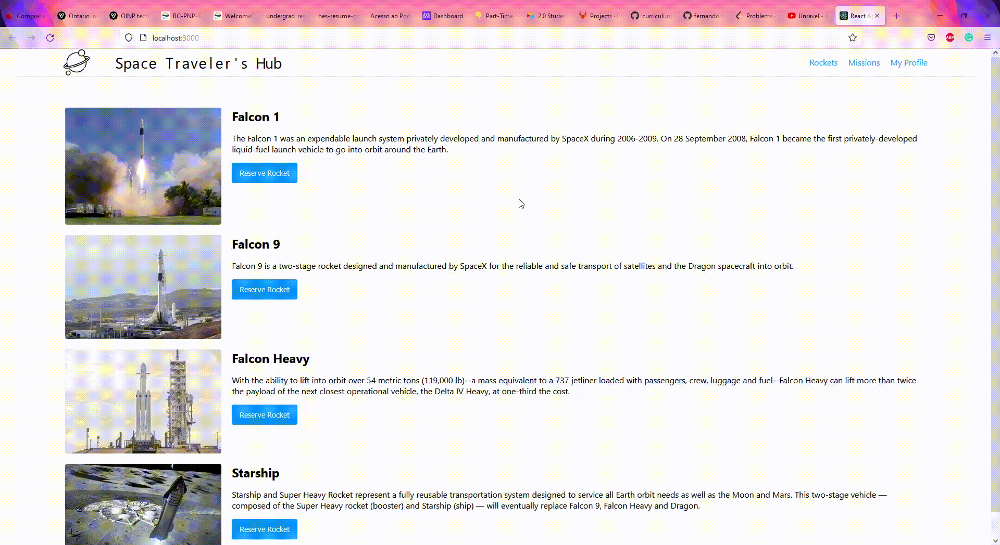

# Space Travelers Hub

> Space Travelers Hub is a React-Redux Web App that allows you to reserve rockets and join missions from Space X!

## Built With

- React-Redux
- Jest

## Live Demo

[Live Demo Link](https://livedemo.com)

## Getting Started

### Prerequisites
- A github account
- NPM installed/added to your PATH

### Setup
- `git clone https://github.com/fernandorpm/space-travelers-hub.git`
- `cd space-travelers-hub`

### Install
- `npm install`

### Usage
- `npm start`
- You can reserve rockets and join missions on their respective pages.
- You can see what rockets yo reserved and what missions you joined in your profile page.

### Run tests
- `npm test`

## Authors

👤 **Author1**

- GitHub: [@githubhandle](https://github.com/githubhandle)
- Twitter: [@twitterhandle](https://twitter.com/twitterhandle)
- LinkedIn: [LinkedIn](https://linkedin.com/in/linkedinhandle)

👤 **Fernando R P Marques**

- GitHub: [@fernandorpm](https://github.com/fernandorpm)
- Twitter: [@rpm_fernando](https://twitter.com/rpm_fernando)
- LinkedIn: [Fernando R P Marques](https://linkedin.com/in/fernandorpm)

## 🤝 Contributing

Contributions, issues, and feature requests are welcome!

Feel free to check the [issues page](../../issues/).

## Show your support

Give a ⭐️ if you like this project!

## 📝 License

This project is [MIT](./MIT.md) licensed.
